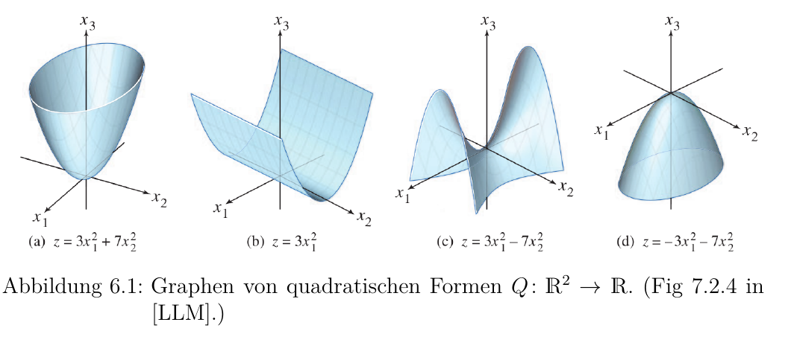
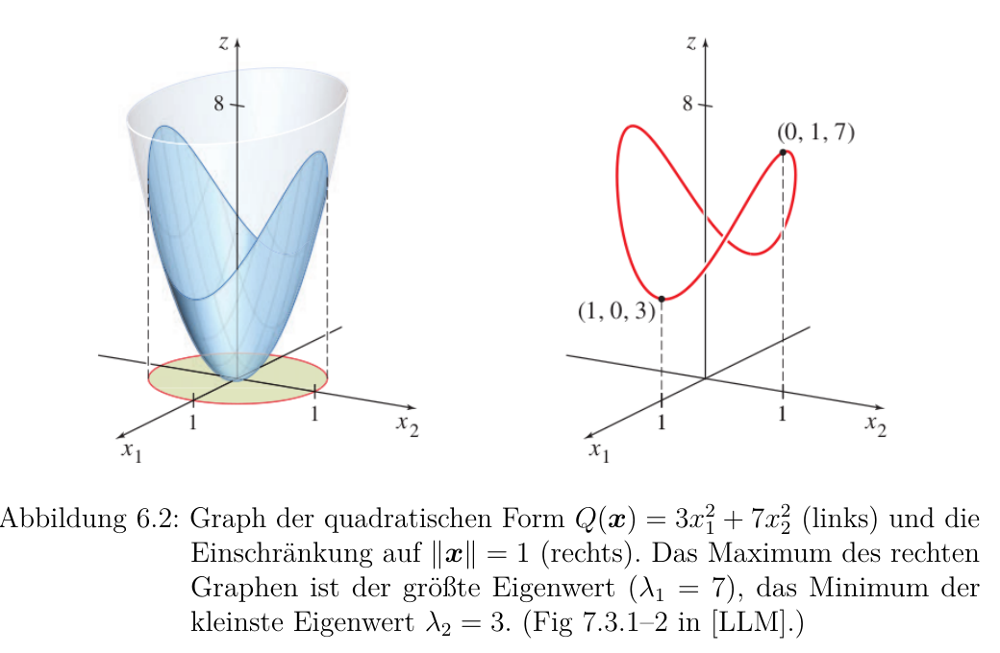

# 第 6 章 二次型与奇异值分解（Quadratische Formen und die Singulärwertzerlegung）

> 来源：`分章节教材/06-Quadratische-Formen-und-SVD.pdf`  
> 说明：本文件翻译当前拆分 PDF 中出现的全部内容。关键名词后保留德文括注，公式用美元符号包裹。
> 校对说明：当前拆分 PDF 实际正文只包含 `6.1 Quadratische Formen`，没有出现 `6.2` 或奇异值分解（Singulärwertzerlegung/SVD）正文。因此本文件完整翻译到 `6.1.8`；标题中的 SVD 来自 PDF 文件名，不代表当前正文包含 SVD 小节。

---

## 6.1 二次型（Quadratische Formen）

### 6.1.1 定义与动机（Definition und Motivation）

到目前为止，我们主要研究的是线性函数（lineare Funktionen）

$$x \mapsto Ax$$

它们是高维空间里“直线函数”的对应物。比如在 $\mathbb{R} \to \mathbb{R}$ 的情况下，线性函数就是

$$f(x)=ax$$

二次型（quadratische Formen）则把一维里的二次函数

$$f(x)=ax^2=xax$$

推广到更高维度。下面这个定义应该已经在分析课（Analysis）里见过。

> **定义 6.1.1（二次型）**  
> $\mathbb{R}^n$ 上的一个二次型（quadratische Form）是一个函数
>
> $$Q:\mathbb{R}^n \to \mathbb{R}$$
>
> 它由
>
> $$Q(x)=x^\top Ax$$
>
> 给出，其中 $A\in\mathbb{R}^{n\times n}$ 是一个对称矩阵（symmetrische Matrix）。

二次型的一个重要应用，是最大化或最小化一个函数。比如在第 5.8.3 节的线性模型（lineare Modelle）里，我们要找一个参数，使平方误差和（Summe der quadratischen Fehler）最小。

这个思想可以推广成最大似然法（Maximum-Likelihood-Methode）。它可以说是现代统计学（moderne Statistik）的核心：我们通过最大化所谓的似然函数（Likelihood-Funktion）来调整统计模型的参数。甚至训练拥有数万亿参数的现代神经网络（neuronale Netze）时，也会用到这个原则。

为什么二次型会出现在这里？联系来自泰勒定理（Taylor's Theorem）。

设 $f:\mathbb{R}^n\to\mathbb{R}$ 是一个足够光滑的函数，$x^\ast$ 是让这个函数取得最小值的点。那么在 $x^\ast$ 附近，可以近似写成

$$
f(x)\approx f(x^\ast)+\nabla f(x^\ast)(x-x^\ast)+\frac{1}{2}(x-x^\ast)^\top H(x^\ast)(x-x^\ast)
$$

其中：

- $\nabla f(x^\ast)$ 是点 $x^\ast$ 处的梯度（Gradient）。
- $H(x^\ast)=\nabla^2 f(x^\ast)$ 是点 $x^\ast$ 处的 Hessian 矩阵（Hesse-Matrix）。

这里 $f(x^\ast)$ 是常数。又因为 $f$ 在 $x^\ast$ 处有一个最小值，所以

$$\nabla f(x^\ast)=0$$

于是，函数 $f$ 在局部可以由二次型来近似：

$$Q(z)=z^\top H(x^\ast)z$$

其中我们定义

$$z=x-x^\ast$$

这个 $Q$ 通常比原来那个可能非常复杂的函数 $f$ 更容易理解。矩阵 $H(x^\ast)$ 描述的是：从点 $x^\ast$ 出发，函数 $f$ 在各个方向上的弯曲程度（Krümmung）。

即使这些内容在分析课里已经见过，从线性代数（lineare Algebra）的角度重新看二次型仍然非常值得。尤其是，我们之前发展的工具可以帮助我们进一步理解二次型的定性（Definitheit）。

---

### 6.1.2 主轴定理（Hauptachsentheorem）

一个二次型可以写成

$$
Q(x)=x^\top Ax=\sum_{i=1}^n a_{ii}x_i^2+\sum_{i=1}^n\sum_{j\neq i}a_{ij}x_ix_j
$$

这里包含两类项：

- 纯二次项（rein quadratische Terme）：$a_{ii}x_i^2$
- 混合项（gemischte Terme）：$a_{ij}x_ix_j$

真正麻烦的是混合项。它们让函数 $Q$ 不容易直接解释。

因为 $A$ 是对称矩阵（symmetrisch），所以它可以正交对角化（orthogonal diagonalisierbar）：

$$A=P\Lambda P^\top$$

其中 $P=(p_1\ \cdots\ p_n)$，它的列向量是标准正交特征向量（orthonormale Eigenvektoren）。于是

$$
x^\top Ax=x^\top P\Lambda P^\top x=(P^\top x)^\top\Lambda(P^\top x)
$$

通过把坐标换到特征向量基（Eigenvektorbasis）中，也就是令

$$y=P^\top x$$

我们就能把二次型写成只含纯二次项的形式。

> **定理 6.1.2（主轴定理，Hauptachsentheorem）**  
> 设 $A\in\mathbb{R}^{n\times n}$ 是一个对称矩阵，它被 $P$ 正交对角化为
>
> $$\Lambda=\operatorname{diag}(\lambda_1,\ldots,\lambda_n)$$
>
> 对 $y=P^\top x$，有
>
> $$
> x^\top Ax=y^\top\Lambda y=\sum_{i=1}^n\lambda_i y_i^2
> $$

这个定理让解释变简单了。

在方向 $p_i$ 上，函数 $Q$ 就像一条简单的抛物线（Parabel）

$$\lambda_i y_i^2$$

特征值（Eigenwert）$\lambda_i$ 决定这个方向上的弯曲强度和方向（Stärke und Richtung der Krümmung）。整个函数 $Q$ 可以看成许多条互相正交方向上的简单抛物线加在一起。

通俗一点说：

> 原坐标里混在一起看不清，换到特征向量坐标后，每个方向各管各的，二次型就被拆成了一堆普通抛物线。

---

### 6.1.3 定性（Definitheit）

在分析课里，我们已经知道：通过定性（Definitheit），可以判断一个临界点是最大值、最小值，还是鞍点（Sattelpunkt）。我们先重复定义。

> **定义 6.1.3（定性，Definitheit）**  
> 设 $A\in\mathbb{R}^{n\times n}$ 是对称矩阵，$Q(x)=x^\top Ax$ 是对应的二次型。那么我们称 $A$ 和 $Q$：
>
> - 正定（positiv definit），如果对所有 $x\neq 0$ 都有 $Q(x)>0$；
> - 正半定（positiv semidefinit），如果对所有 $x\neq 0$ 都有 $Q(x)\geq 0$；
> - 负定（negativ definit），如果对所有 $x\neq 0$ 都有 $Q(x)<0$；
> - 负半定（negativ semidefinit），如果对所有 $x\neq 0$ 都有 $Q(x)\leq 0$；
> - 不定（indefinit），如果存在一个 $x\in\mathbb{R}^n$ 使 $Q(x)>0$，同时又存在另一个 $x\in\mathbb{R}^n$ 使 $Q(x)<0$。

图 6.1 直观展示了这些定性情况。

**(a)** 有

$$Q(x)=3x_1^2+7x_2^2>0$$

对所有 $x\neq 0$ 都成立，所以这个二次型是正定（positiv definit），并且有一个全局最小值（globales Minimum）。

**(b)** 有

$$Q(x)=3x_1^2\geq 0$$

所以这个二次型是正半定（positiv semidefinit）。但是比如

$$Q((0,2))=0$$

所以它不是正定。对应的函数有最小值，但这个最小值不是严格的（nicht strikt）。

**(c)** 有

$$Q(x)=3x_1^2-7x_2^2$$

当 $x=(1,0)$ 时，$Q(x)>0$；当 $x=(0,1)$ 时，$Q(x)<0$。所以 $Q$ 是不定的（indefinit），既没有最小值，也没有最大值。

**(d)** 有

$$Q(x)=-3x_1^2-7x_2^2<0$$

对所有 $x\neq 0$ 都成立，所以这个二次型是负定（negativ definit），并且有一个全局最大值（globales Maximum）。

定性最好通过特征值来判断。

> **定理 6.1.4**  
> 设 $A\in\mathbb{R}^{n\times n}$ 是对称矩阵。那么二次型
>
> $$Q(x)=x^\top Ax$$
>
> 满足：
>
> 1. 正定（positiv definit）当且仅当所有特征值都严格为正；
> 2. 正半定（positiv semidefinit）当且仅当所有特征值都非负；
> 3. 负定（negativ definit）当且仅当所有特征值都严格为负；
> 4. 负半定（negativ semidefinit）当且仅当所有特征值都非正；
> 5. 不定（indefinit）当且仅当存在一个严格正的特征值，同时存在一个严格负的特征值。

**证明。**  
由主轴定理（Hauptachsentheorem，定理 6.1.2），我们得到

$$
Q(x)=x^\top Ax=y^\top\Lambda y=\sum_{i=1}^n\lambda_i y_i^2
$$

其中

$$y=P^\top x$$

$\lambda_1,\ldots,\lambda_n$ 是 $A$ 的特征值。

因为 $P$ 可逆，所以对每个 $x$，都存在唯一的 $y$ 满足 $y=P^\top x$。因此，当 $x\neq 0$ 时，$Q(x)$ 取到的值，和

$$\sum_{i=1}^n\lambda_i y_i^2$$

取到的值完全对应。

而这个和式的符号显然由特征值 $\lambda_i$ 的符号决定。于是得到定理中的五种情况。

---

### 6.1.4 特征值的变分刻画（Variationelle Charakterisierung von Eigenwerten）

二次型还给了我们一个很意外的新视角：可以把矩阵的特征值理解成某个最大化或最小化问题的结果。

具体来说，我们研究

$$Q(x)=x^\top Ax$$

但不是在所有 $x$ 上随便取，而是在限制条件下取最大值或最小值。这个思想称为特征值的变分刻画（variationelle Charakterisierung der Eigenwerte）。

我们先只刻画最大和最小的特征值。

> **定理 6.1.5**  
> 设 $A\in\mathbb{R}^{n\times n}$ 是对称矩阵，它的特征值按大小排序为
>
> $$\lambda_1\geq\lambda_2\geq\cdots\geq\lambda_n$$
>
> 那么
>
> $$
> \lambda_n=\min_{\|x\|=1}x^\top Ax\leq \max_{\|x\|=1}x^\top Ax=\lambda_1
> $$
>
> 最小值在 $\lambda_n$ 对应的特征向量处取得，最大值在 $\lambda_1$ 对应的特征向量处取得。

**证明。**  
和主轴定理（定理 6.1.2）一样，有

$$
Q(x)=\sum_{i=1}^n\lambda_i y_i^2
$$

其中

$$y=P^\top x$$

因为 $P$ 是正交矩阵（orthogonal），所以

$$\|y\|=\|P^\top x\|=\|x\|=1$$

这一步可以作为练习验证。

因为所有 $y_i^2$ 都是非负的，所以

$$
Q(x)=\sum_{i=1}^n\lambda_i y_i^2\leq \lambda_1\sum_{i=1}^n y_i^2=\lambda_1\|y\|^2=\lambda_1
$$

此外，当 $y=e_1$，也就是 $x=Pe_1=p_1$ 时，有

$$Q(x)=\lambda_1$$

所以最大特征值满足

$$
\lambda_1=\max_{\|x\|=1}Q(x)=\max_{\|x\|=1}x^\top Ax
$$

用同样的论证，只不过改成向下估计，可以证明

$$
\lambda_n=\min_{\|x\|=1}Q(x)=\min_{\|x\|=1}x^\top Ax
$$

> **例 6.1.6**  
> 定理 6.1.5 在图 6.2 中得到了图形说明。

左边是二次型

$$
Q(x)=x^\top Ax=x^\top
\begin{pmatrix}
3 & 0\\
0 & 7
\end{pmatrix}
x
$$

的图像。

因为 $A$ 是对角矩阵（Diagonalmatrix），所以可以直接读出特征值：

$$3,\ 7$$

右边展示的是把函数 $Q(x)$ 限制在

$$\|x\|=1$$

这个区域时的图像。几何上，这就是 $Q$ 和单位圆柱（Einheitszylinder）的交线。

正如预期，这个受限函数的最大值是 $7$，最小值是 $3$。

这个论证还可以进一步细化，推广到其他所有特征值。

> **定理 6.1.7**  
> 设 $A\in\mathbb{R}^{n\times n}$ 是对称矩阵，特征值按大小排序为
>
> $$\lambda_1\geq\lambda_2\geq\cdots\geq\lambda_n$$
>
> 对应的标准正交特征向量（orthonormale Eigenvektoren）为
>
> $$p_1,\ldots,p_n$$
>
> 那么对所有 $k=1,\ldots,n$，有
>
> $$
> \lambda_k=
> \max_{\substack{\|x\|=1\\ x\perp\operatorname{span}\{p_1,\ldots,p_{k-1}\}}}
> x^\top Ax
> =
> \min_{\substack{\|x\|=1\\ x\perp\operatorname{span}\{p_{k+1},\ldots,p_n\}}}
> x^\top Ax
> $$
>
> 最大值或最小值分别在 $\lambda_k$ 对应的特征向量处取得。

**证明思路。**  
如果

$$x\perp\operatorname{span}\{p_1,\ldots,p_{k-1}\}$$

并且

$$y=P^\top x$$

那么

$$y_1,\ldots,y_{k-1}=0$$

因此

$$
Q(x)=\sum_{i=k}^n\lambda_i y_i^2
\leq
\lambda_k\sum_{i=1}^n y_i^2
=
\lambda_k\|y\|^2
=
\lambda_k
$$

其中当 $y=e_k$，也就是 $x=Pe_k=p_k$ 时，取到

$$Q(x)=\lambda_k$$

对于最小值部分，论证类似，只是改成向下估计。

这个刻画可以帮助我们理解 PCA（Hauptkomponentenanalyse）。

假设随机向量 $Y\in\mathbb{R}^n$ 的协方差矩阵（Kovarianzmatrix）为

$$\operatorname{Cov}(Y)=\Sigma$$

由协方差的线性性质可知，对任意确定方向 $x\in\mathbb{R}^n$，且 $\|x\|=1$，有

$$
\operatorname{Var}(x^\top Y)=x^\top\Sigma x
$$

因此，$\Sigma$ 的第一主成分（erste Hauptkomponente）$p_1$，就是让方差最大的方向；这个最大方差等于

$$\lambda_1$$

接下来，第二主成分要在与 $p_1$ 正交的空间里寻找，并在剩余方向中继续最大化方差。后面的主成分依此类推。

还有一个相关的刻画，就是下面的 Courant-Fischer 定理。

> **定理 6.1.8（最小-最大原则，Minimum-Maximum-Prinzip）**  
> 设 $A\in\mathbb{R}^{n\times n}$ 是对称矩阵，特征值按大小排序为
>
> $$\lambda_1\geq\lambda_2\geq\cdots\geq\lambda_n$$
>
> 那么对所有 $k=1,\ldots,n$，有
>
> $$
> \lambda_k
> =
> \max_{\dim(V)=k}\ \min_{\substack{x\in V\\ \|x\|=1}} x^\top Ax
> $$
>
> 并且
>
> $$
> \lambda_k
> =
> \min_{\dim(V)=n-k+1}\ \max_{\substack{x\in V\\ \|x\|=1}} x^\top Ax
> $$
>
> 其中 $V$ 分别是 $\mathbb{R}^n$ 的子向量空间（Untervektorraum）。最大值或最小值分别在 $\lambda_k$ 对应的特征向量处取得。

**证明（可选）。**  
我们沿用前面证明中的记号，并先从第二个等式开始。

首先注意到

$$
V:=\operatorname{span}\{p_k,\ldots,p_n\}
=
\operatorname{span}\{p_1,\ldots,p_{k-1}\}^{\perp}
$$

这是一个维数为

$$\dim(V)=n-k+1$$

的子空间。由定理 6.1.7 可得

$$
\max_{\substack{x\in V\\ \|x\|=1}}x^\top Ax
=
\max_{x\in V}\frac{x^\top Ax}{x^\top x}
=
\lambda_k
$$

现在令 $V$ 是任意另一个满足

$$\dim(V)=n-k+1$$

的子空间。那么 $V$ 与

$$\operatorname{span}\{p_1,\ldots,p_k\}$$

的交集不为空。否则，它们张成空间的维数会达到 $n+1$，这在 $\mathbb{R}^n$ 中不可能。

所以存在一个元素 $v\in V$，可以写成

$$
v=\sum_{i=1}^k c_i p_i
$$

对这个元素，有

$$
\frac{v^\top Av}{v^\top v}
=
\frac{\sum_{i=1}^k c_i^2\lambda_i}{\sum_{i=1}^k c_i^2}
\geq
\lambda_k
$$

因为在每一个维数为 $n-k+1$ 的子空间里，都存在这样的元素，所以得到

$$
\lambda_k
=
\min_{\dim(V)=n-k+1}\ \max_{\substack{x\in V\\ \|x\|=1}}x^\top Ax
$$

第一个等式可以通过把第二个等式应用到矩阵

$$\tilde{A}=-A$$

得到。矩阵 $\tilde{A}$ 的特征值排序为

$$-\lambda_n\geq -\lambda_{n-1}\geq\cdots\geq-\lambda_1$$

---

## 本章翻译后的学习抓手

这一章的主线很清楚：

1. 二次型（quadratische Form）是 $Q(x)=x^\top Ax$。
2. 对称矩阵（symmetrische Matrix）可以正交对角化，所以二次型能换坐标，拆成 $\sum_i\lambda_i y_i^2$。
3. 二次型的定性（Definitheit）由特征值符号决定。
4. 最大和最小特征值可以看成单位球约束下 $x^\top Ax$ 的最大值和最小值。
5. PCA 的第一主成分，就是让 $x^\top\Sigma x$ 最大的方向。

一句话：

> 二次型把“函数的弯曲”交给矩阵 $A$ 表达，而特征值告诉我们每个主方向弯得多厉害、朝上还是朝下。
